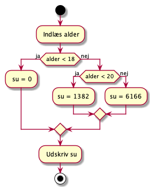
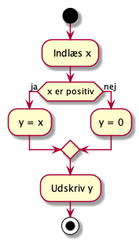
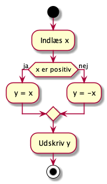
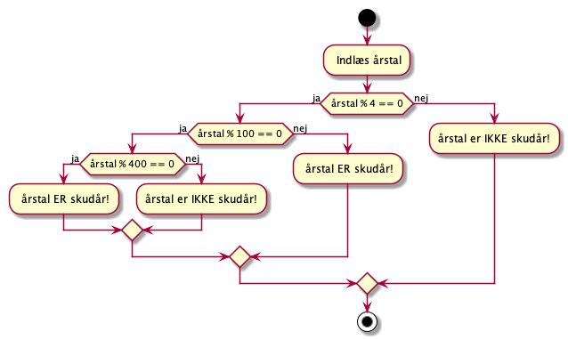
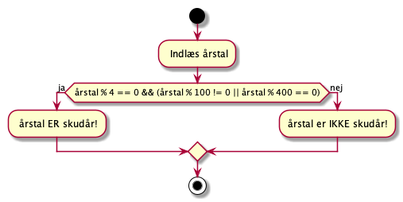

# Programmeringsøvelser til Betingede valg (if/else)

## Eksempel, SU

Su reglerne er mange og lange. I dette ekesempel laver vi som om at alle under 20 år kun får grundsatsen for hjemmeboende. Sådan er det heldigvis ikke, men nu gør vi det lidt enklere :-)



<!--
@startuml
start
scale max 1000 height
: Indlæs alder;
if (alder < 18) then (ja)
    : su = 0;
else (nej)
    if (alder < 20) then (ja)
        :su = 1382;
    else (nej)
        :su = 6166;
    endif
endif
: Udskriv su;
stop 
@enduml
-->


### Inddata

```black
Indtast alder:    
```

### Uddata

Når du taster `17`
```
Din su er: 0
```
Når du taster `19`
```
Din su er: 1382
```
Når du taster `21`
```
Din su er: 6166
```
### Program kode

```csharp
using System;

namespace su
{
    public class Program
    {
        public static void Main(string[] args)
        {
            Console.Write("Indtast alder: ");
            int alder = Convert.ToInt32(Console.ReadLine());

            double su;

            if (alder < 18)
            {
                su = 0;
            }
            else if (alder < 20)
            {
                su = 1382; // 2020 grundsats
            }
            else
            {
                su = 6166; // 202 sats
            }

            Console.WriteLine("Din su er {0}.", su);
        }
    }
}

```

<!-- Brug eventuelt indholdet i `øv1_1.zip` på __it's  learning__. -->
<!-- R 5.5 -->

<div class="page"/>

## Øvelse 1.1

Variablerne `x` og `y` er af typen `double`.  
Skriv programstumper som sætter `y` til værdien af `x` hvis `x` er positiv, ellers 0.  



<!--
@startuml
start
scale max 1000 height
: Indlæs x;
if (x er positiv)) then (ja)
    : y = x;
else (nej)
    :y = 0;
endif
: Udskriv y;
stop 
@enduml
-->

### Inddata

```black
Indtast et tal:    
```

### Uddata

Når du taster `7`
```
y: 7
```
Når du taster `-7`
```
y: 0
```


<!-- Brug eventuelt indholdet i `øv1_1.zip` på __it's  learning__. -->
<!-- R 5.5 -->

<div class="page"/>

## Øvelse 1.2

Variablerne `x` og `y` er af typen `double`.  
Skriv programstumper som sætter `y` til den absolutte værdi af `x`. Den absolutte værdi er tallet som postivt. (-12 er lig med 12, og 7 er stadig lig med 7.)  
Du skal løse opgaven ___uden___ bruge metoden `Math.abs()`.  



<!--
@startuml
start
scale max 1000 height
: Indlæs x;
if (x er positiv)) then (ja)
    : y = x;
else (nej)
    :y = 0;
endif
: Udskriv y;
stop 
@enduml
-->

### Inddata

```black
Indtast et tal:    
```

### Uddata

Når du taster `7`
```
y: 7
```
Når du taster `-7`
```
y: 7
```

<!-- R 5.6 -->

<div class="page"/>

## Øvelse 1.3

Skriv et program som afgør om et år er skudår eller ikke er.
Brug algoritmen fra rutediagrammet...


<!--
@startuml

start
scale max 1000 height

: Indlæs årstal;

'floating note right: Inddata

if (årstal % 4 == 0) then (ja)
    if (årstal % 100 == 0) then (ja)
        if (årstal % 400 == 0) then (ja)
            : årstal ER skudår!;
' floating note right: Uddata
        else (nej)
            :årstal er IKKE skudår!;
'            floating note right: Uddata
        endif
    else (nej)
        : årstal ER skudår!;
'        floating note right: Uddata
    endif
else (nej)
    :årstal er IKKE skudår!;
'    floating note right: Uddata
endif

stop 

@enduml
-->

Bemærk at programmet både kan implementeres med indlejrede if-sætninger,
eller med en enkelt if-sætning med et sammensat logisk udtryk, hvor flere tilstande kompineres med && (AND) og || (OR). 


<!--
@startuml

start
scale max 1000 height

: Indlæs årstal;

if (årstal % 4 == 0 && (årstal % 100 != 0 || årstal % 400 == 0)) then (ja)
    : årstal ER skudår!;
else (nej)
    :årstal er IKKE skudår!;
endif

stop 

@enduml
-->

### Inddata

```black
Årstal:    
```

### Uddata

```
1984 er skudår!    
```

```
1900 er IKKE skudår!    
```
